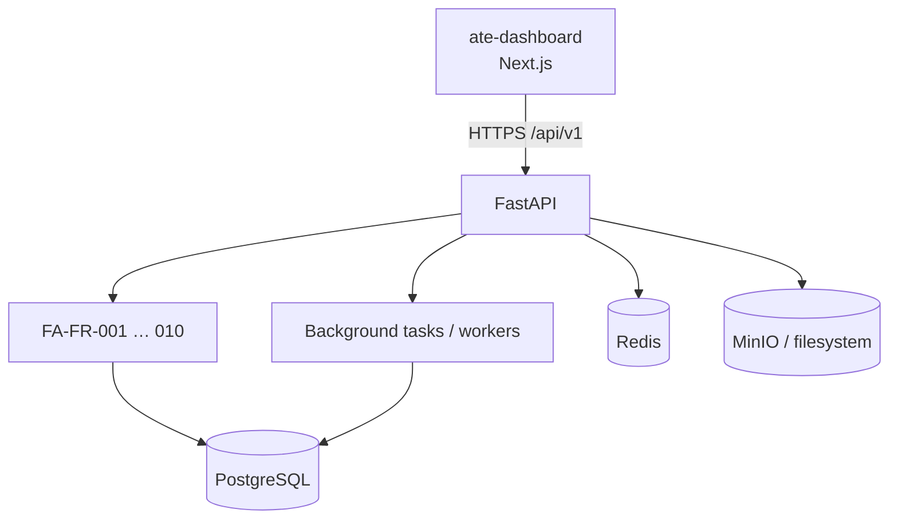
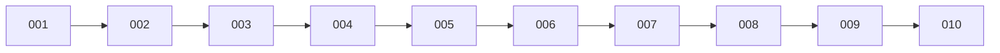

# 01 — System Architecture

**Product:** AI-Powered Semiconductor Failure Analysis Agent  
**Related:** [02 Software Design](02_SOFTWARE_DESIGN_SPECIFICATION.md) · [03 Database](03_DATABASE_DESIGN.md) · [04 API](04_API_SPECIFICATION.md) · [09 Deployment](09_DEPLOYMENT_GUIDE.md)

---

## 1. Purpose

Platform that ingests STIL and semiconductor tester logs, runs a gated analytics pipeline (FA-FR-001→010), and delivers explainable failure-analysis decision support.

## 2. Technology Stack

| Layer | Technology |
|-------|------------|
| Dashboard | Next.js 16 (App Router), React 19, TypeScript, Tailwind CSS v4, Zustand, TanStack Query, Recharts |
| API | Python 3.12+, FastAPI, Pydantic v2, SQLAlchemy 2.x, Alembic, AsyncIO |
| Data | PostgreSQL (system of record), Redis (cache/rate-limit/optional queue), MinIO or filesystem (raw files & exports) |
| Packaging | Docker-ready; local uvicorn + npm for development |

## 3. Functional Modules

| ID | Module | Code |
|----|--------|------|
| FA-FR-001 | Test Data Ingestion | `backend/ingestion/` |
| FA-FR-002 | Failure Pattern Detection | `analytics/pattern_detection/` |
| FA-FR-003 | Failure Rate Computation | `analytics/failure_rates/` |
| FA-FR-004 | Fault Classification | `backend/classification/` |
| FA-FR-005 | Recurring Failure Identification | `backend/recurring/` |
| FA-FR-006 | Failure-to-Pattern Correlation | `backend/correlation/` |
| FA-FR-007 | Die-Level Analysis | `backend/die_analysis/` |
| FA-FR-008 | Wafer-Level Analysis | `backend/wafer_analysis/` |
| FA-FR-009 | AI Fault Type Prediction | `backend/root_cause/` |
| FA-FR-010 | Enterprise Reporting | `backend/reporting/` |

Evaluation / training lives in `evaluation/` and does not alter FA-FR business logic. See [05 AI Architecture](05_AI_ARCHITECTURE.md).

## 4. High-Level Architecture

**Trust boundary:** the UI never accesses PostgreSQL directly. All analytics go through versioned REST APIs.

## 5. Pipeline and Lineage Gates

Production path is **acyclic and gated**: each module requires completed upstream audits for the same dataset/upload lineage.

Legacy upload-only routes remain for compatibility; they do not replace production gates. See [04 API Specification](04_API_SPECIFICATION.md).

## 6. Frontends

| App | Port | Role |
|-----|------|------|
| `ate-dashboard` | 3000 | Production FA-FR UI (glass enterprise theme) |
| `frontend` | 5173 | Evaluation workbench (separate; leave intact) |
| `dashboard.py` | 8000 | Lightweight local CLI dashboard (optional) |

## 7. Logging, Monitoring, Observability

### Logging
- Structured application logs (JSON preferred in production).
- Per-run correlation via `analysis_id` / `execution_id`.
- Append-only audit tables per module (`*_audit_logs`, `*_history`).
- Evaluation JSONL under `backend/storage/evaluation_logs/` when evaluation runs.

### Monitoring (targets)
- RED: request rate, latency, error rate.
- Queue depth / worker saturation (when Redis/Celery enabled).
- DB connections and slow queries.
- Per-module `processing_ms`, throughput, `api_sla_met`, report completeness.

### Observability (target)
- OpenTelemetry traces spanning API → service → repository.
- Metrics scrape (Prometheus) and dashboards (Grafana).
- Log aggregation (Loki/ELK). Full wiring is deployment-dependent; see [09 Deployment](09_DEPLOYMENT_GUIDE.md).

## 8. Non-Functional Targets

| Concern | Target |
|---------|--------|
| Retrieval API | p95 &lt; 2s |
| Heavy analytics | Async preferred |
| Reports | &lt; 10s or queued |
| Scale | 100k+ records; horizontal API/workers |
| Availability | Multi-replica API/UI; HA Postgres/Redis/MinIO in prod |
| AI stance | Probable fault types + evidence — not definitive root cause |

## 9. Cross-References

- Design patterns & services → [02](02_SOFTWARE_DESIGN_SPECIFICATION.md)
- Schema & migrations → [03](03_DATABASE_DESIGN.md)
- Security → [07](07_SECURITY_ARCHITECTURE.md)
- Performance & tests → [08](08_PERFORMANCE_AND_TESTING.md)
- Operators / users → [09](09_DEPLOYMENT_GUIDE.md), [10](10_USER_GUIDE.md)
