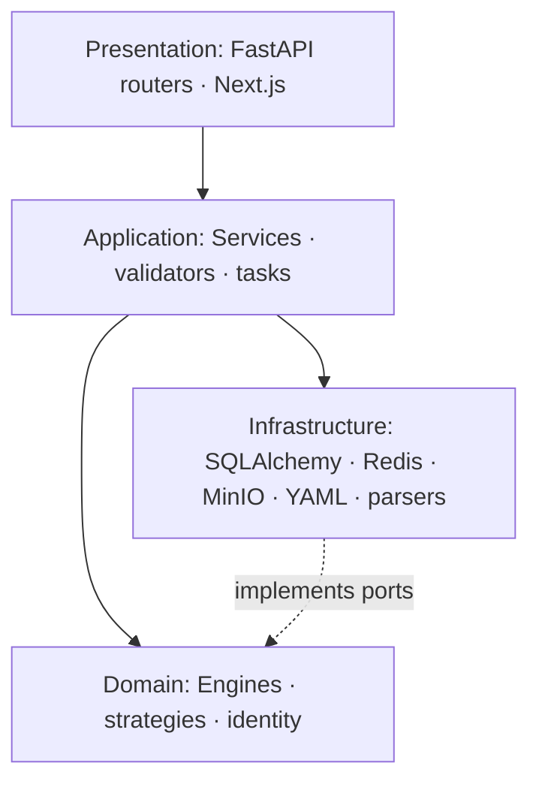
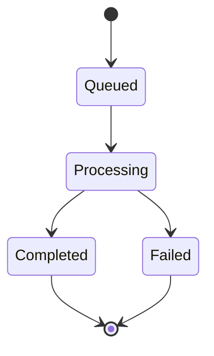

# 02 — Software Design Specification

**Related:** [01 System Architecture](01_SYSTEM_ARCHITECTURE.md) · [03 Database](03_DATABASE_DESIGN.md) · [04 API](04_API_SPECIFICATION.md) · [06 Parser](06_PARSER_FRAMEWORK.md)

---

## 1. Purpose

Define application structure, design patterns, and runtime orchestration for FA-FR-001→010.

## 2. Clean Architecture Layers



**Rule:** routers and ORM do not own business scoring. Engines stay deterministic and framework-agnostic where possible.

## 3. Module Package Layout

Typical production module:

| File | Role |
|------|------|
| `production_api.py` / `*_api.py` | HTTP, RBAC, rate limits |
| `schemas.py` | Pydantic request/response DTOs |
| `security.py` | Role checks, rate limiter |
| `production_service.py` | Use-case orchestration |
| `production_engine.py` | Domain algorithms |
| `production_repository.py` | Persistence + lineage load |
| `tasks.py` | Async job entry points |
| `config/*_production.yaml` | Versioned thresholds |

## 4. Design Patterns

| Pattern | Application |
|---------|-------------|
| Repository | All DB access via repositories; no SQL in routers |
| Service layer | `execute(...)` = validate → compute → benchmark → persist |
| Factory | Parser / adapter selection by format |
| Strategy | Correlation metrics, clustering, exporters, prediction models |
| Dependency injection | FastAPI `Depends` for DB session, security, settings |
| DDD bounded contexts | One context per FA-FR module |
| Append-only versioning | New `analysis_id` / history rows; never rewrite prior facts |

## 5. Service Layer Contract

Standard production flow:

1. Create audit row (`processing`)
2. Load analysis source (nested upstream repositories / audits)
3. Validate lineage and inputs → `422` with structured issues on failure
4. Run engine
5. Attach benchmarks (latency, throughput, SLA flags)
6. Persist facts + history + complete audit
7. On exception: mark audit `failed`, return structured error

Sync and async paths share the same `execute` implementation.

## 6. State Machine — Analysis Run



Upload/parse states: `Received → DetectingFormat → Parsing → Validating → Completed | Quarantined | Failed`.

## 7. Queue Architecture

| Mode | Mechanism | Use |
|------|-----------|-----|
| Default | FastAPI `BackgroundTasks` + isolated async DB sessions | Dev / single-node |
| Optional | Celery + Redis (`CELERY_ENABLED`, queue `ingestion`) | Durable ingestion |
| Target | Redis Streams / broker + DLQ + idempotent handlers | Multi-node HA |

Job payload: request DTO + `execution_id`. Status of record is always in PostgreSQL audit tables (Redis is not the source of truth).

## 8. Worker Architecture

- Same service code as sync path; only transport differs.
- Scale workers on queue depth / CPU.
- Retry with backoff; dead-letter after max attempts; alert ops.
- Heavy die/wafer jobs may use larger node pools.

## 9. Event Architecture

Logical domain events (emit via outbox / bus in target deployments):

`DatasetNormalized`, `PatternsDetected`, `RatesComputed`, `FaultsClassified`, `RecurrenceCompleted`, `CorrelationCompleted`, `DieAnalysisCompleted`, `WaferAnalysisCompleted`, `PredictionsCompleted`, `ReportGenerated`, `ReportExported`, `FeedbackReceived`

Every event carries lineage IDs (`dataset_id` / `upload_id`, `analysis_id`, `execution_id`).

## 10. Configuration

- Environment: `.env` / `backend/settings.py` (DB, Redis, paths, feature flags)
- Module YAML with `config_version` persisted on analysis rows
- Request-level threshold overrides (validated ranges)

## 11. Error Envelope

```json
{
  "detail": {
    "code": "INVALID_*_SOURCE",
    "message": "Human-readable summary",
    "issues": [{ "code": "...", "message": "..." }]
  }
}
```

Common HTTP: `404` missing source, `403` RBAC, `422` validation/lineage, `429` rate limit, `500` unexpected (logged with incident id).

## 12. Dual API Strategy

- **Production:** lineage-gated, RBAC, append-only history.
- **Legacy:** upload-only / older prefixes for compatibility (`legacy=true` or `/api/v1/{die|wafer|root-cause|...}`).

Prefer production contracts for new work. Deprecate legacy gradually.

## 13. Cross-References

- System context → [01](01_SYSTEM_ARCHITECTURE.md)
- Tables → [03](03_DATABASE_DESIGN.md)
- Endpoints → [04](04_API_SPECIFICATION.md)
- Parsers/plugins → [06](06_PARSER_FRAMEWORK.md)
- AI pipeline → [05](05_AI_ARCHITECTURE.md)
