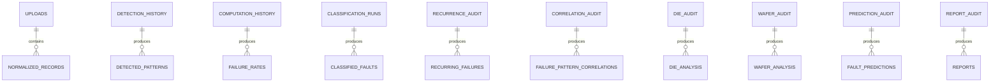

# 03 — Database Design

**Related:** [01 System Architecture](01_SYSTEM_ARCHITECTURE.md) · [02 Software Design](02_SOFTWARE_DESIGN_SPECIFICATION.md) · [04 API](04_API_SPECIFICATION.md)

---

## 1. Purpose

PostgreSQL is the system of record for uploads, normalized test data, analytics facts, audits, and report metadata. Object blobs (raw files, exports) live in MinIO or the filesystem; Redis holds ephemeral cache/queue state only.

**SQLite is not supported** for the production API.

## 2. Migrations (Alembic)

| Revision | File | Scope |
|----------|------|-------|
| 001 | `001_initial_schema.py` | Baseline ORM tables |
| 002 | `002_fa_fr_001_ingestion.py` | FA-FR-001 ingestion |
| 003 | `003_fa_fr_002_pattern_detection.py` | FA-FR-002 |
| 004 | `004_fa_fr_003_failure_rates.py` | FA-FR-003 |
| 005 | `005_fa_fr_004_recurrence.py` | Recurrence tables (now FA-FR-005) |
| 006 | `006_fa_fr_005_recurrence_classification.py` | FA-FR-005 alignment + recommendations |
| 007 | `007_fa_fr_006_correlation.py` | FA-FR-006 |
| 008 | `008_fa_fr_007_die_analysis.py` | FA-FR-007 |
| 009 | `009_fa_fr_008_wafer_analysis.py` | FA-FR-008 |
| 010 | `010_fa_fr_009_fault_prediction.py` | FA-FR-009 |
| 011 | `011_fa_fr_010_reporting.py` | FA-FR-010 |

> Migration file numbers do not always equal FA-FR numbers (e.g. recurrence spans 005–006). Apply with `alembic upgrade head`.

## 3. Design Principles

- **Append-only analytics:** new analysis/history rows; do not overwrite prior results.
- **Deterministic identity:** canonical keys + UUIDv5 / SHA-256 where defined by modules.
- **Lineage:** foreign keys / audit references to upstream `analysis_id` / `execution_id`.
- **Unique constraints:** typically `(analysis_id, canonical_*_key)`.
- **Shared recommendations:** `engineering_recommendations` linked optionally to correlation, die, wafer, prediction, report.

## 4. Entity Overview



## 5. Tables by Module

### FA-FR-001 Ingestion
`uploads`, `upload_history`, `parser_metadata`, `validation_results`, `normalized_records`, `audit_logs`, `ingestion_statistics`, `ingestion_datasets`  
Legacy overlap: `upload_metadata`, `test_records`

### FA-FR-002 Patterns
`detected_patterns`, `pattern_occurrences`, `pattern_statistics`, `pattern_confidence`, `detection_history`, `rule_library`  
Legacy: `pattern_analysis_runs`

### FA-FR-003 Failure rates
`failure_rates`, `failure_statistics`, `historical_failure_rates`, `trend_analysis`, `threshold_configuration`, `computation_history`  
Legacy: `failure_rate_runs`

### FA-FR-004 Classification
`classification_runs`, `classified_faults`

### FA-FR-005 Recurrence
`recurring_failures`, `recurrence_statistics`, `recurrence_history`, `recurrence_trends`, `hotspot_analysis`, `recurrence_audit_logs`  
Shared: `engineering_recommendations`  
Legacy: `recurring_events`, `recurring_analysis_runs`

### FA-FR-006 Correlation
`failure_pattern_correlations`, `correlation_statistics`, `correlation_history`, `correlation_trends`, `correlation_audit_logs`  
Legacy: `correlation_analysis_runs`

### FA-FR-007 Die
`die_analysis`, `die_failure_statistics`, `die_hotspots`, `die_clusters`, `die_health_scores`, `die_analysis_history`, `die_audit_logs`  
Legacy: `die_analysis_runs`

### FA-FR-008 Wafer
`wafer_analysis`, `wafer_statistics`, `wafer_hotspots`, `wafer_health_scores`, `wafer_yield_metrics`, `wafer_analysis_history`, `wafer_audit_logs`  
Legacy: `wafer_analysis_runs`

### FA-FR-009 Fault prediction
`fault_predictions`, `prediction_history`, `prediction_statistics`, `prediction_feedback`, `prediction_models`, `prediction_audit_logs`  
Legacy: `root_cause_prediction_runs`

### FA-FR-010 Reporting
`reports`, `report_history`, `report_templates`, `report_exports`, `benchmark_results`, `report_audit_logs`  
Legacy: `engineering_report_runs`

### Evaluation
`evaluation_runs`, `model_training_runs`

## 6. Indexes and Constraints (guidance)

- Index lineage columns: `upload_id`, `dataset_id`, `analysis_id`, `execution_id`, `pattern_id`, severity/status.
- Unique on natural keys within an analysis run.
- Prefer parameterized SQLAlchemy; avoid unbounded full-table scans on `normalized_records` without filters.
- Large JSON matrices: acceptable for interactive payloads; archive/partition audits by time at scale.

## 7. Optimization

| Technique | When |
|-----------|------|
| Read replicas | Dashboard GET traffic |
| Partition audit/history | High volume |
| Batch inserts | Ingestion 100k+ |
| Connection pooling | Always in production |
| Avoid N+1 | Repository list endpoints |

## 8. Ops

```powershell
$env:PYTHONPATH = (Get-Location).Path
python -m alembic upgrade head
python -m alembic current
```

Connection defaults (override via `.env`): host `localhost:5432`, database `failure_analysis_db`, user `postgres`.

## 9. Cross-References

- Persistence patterns → [02](02_SOFTWARE_DESIGN_SPECIFICATION.md)
- Object storage → [09](09_DEPLOYMENT_GUIDE.md)
- Security of data access → [07](07_SECURITY_ARCHITECTURE.md)
