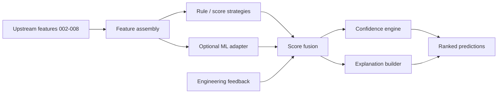

# 05 — AI Architecture

**Related:** [01 System Architecture](01_SYSTEM_ARCHITECTURE.md) · [02 Software Design](02_SOFTWARE_DESIGN_SPECIFICATION.md) · [08 Performance & Testing](08_PERFORMANCE_AND_TESTING.md)

---

## 1. Purpose

Describe how AI and statistical intelligence support semiconductor failure analysis **without** replacing engineering judgment.

**Principle:** FA-FR-009 outputs **probable fault types** with confidence and evidence — not definitive root causes.

## 2. Placement in the Pipeline

Features for prediction are assembled from completed FA-FR-002…008 outputs (patterns, rates, classification, recurrence, correlation, die, wafer). FA-FR-010 surfaces ranked hypotheses and explanations in enterprise reports.



## 3. FA-FR-004 Classification (hybrid)

Layered approach (config-driven taxonomy):

1. **Rules** — bin tables, pattern signatures, YAML taxonomy (`config/fault_taxonomy.yaml`)
2. **ML (optional)** — RF / XGBoost when `requirements-ml.txt` installed and labels available
3. **LLM (optional assistive)** — narrative only; never sole authority

Output shape: `{ fault_type, severity, confidence, method, explanation }`.

## 4. FA-FR-009 Fault Prediction (production)

- Explainable rule-based scoring with optional future model adapters.
- Tables: `fault_predictions`, `prediction_history`, `prediction_statistics`, `prediction_feedback`, `prediction_models`, `prediction_audit_logs`.
- API: `/api/v1/fault-prediction/predict` and `/feedback`.
- Gated on completed FA-FR-001→008 audits.

## 5. Confidence Engine

Composite inputs (weights in module YAML):

- Statistical strength (e.g. correlation coefficients / p-values)
- Upstream pattern & classification confidence
- Recurrence confidence and sample adequacy
- Spatial corroboration (die/wafer)
- Feedback agreement rates

Output: `confidence_score ∈ [0,1]`, severity bands, contributing-factor JSON. Low confidence must remain visible to users.

## 6. Prompt Engine

For assistive LLM paths (evaluation / legacy narrative):

| Concern | Practice |
|---------|----------|
| Templates | Versioned; temperature constrained |
| Context | Size-bounded; secrets redacted |
| Output | Post-validate JSON; never overwrite statistical facts |
| Audit | Log prompt version + execution id |

Keep LLM off the critical path for production FR-009 core scores.

## 7. Model Registry

`prediction_models` (and evaluation `model_training_runs`) track model id, version, algorithm, metrics, and active flag. Prefer **shadow mode** before promoting a new model to production scoring.

## 8. Feature Store (logical)

Current: features assembled at request time from PostgreSQL lineage facts.  
Target: materialize feature snapshots keyed by `analysis_id` for training reproducibility and RAG grounding.

## 9. Memory

| Tier | Store | Use |
|------|-------|-----|
| Working | Request context / Redis | Current run features |
| Episodic | Prediction + feedback tables | Past cases |
| Procedural | YAML rules / model versions | How to score |
| Semantic (future) | Vector index | Similar historical FA |

Tenant isolation required for all tiers in multi-tenant deployments.

## 10. Evaluation Framework

Independent module `evaluation/`:

- Dataset discovery, STIL↔log matching
- Full or per-module pipeline runs
- Metrics: accuracy, precision, recall, F1, ROC-AUC, confusion matrix
- Training: RF, XGBoost, Gradient Boosting, LightGBM when labels exist
- Exports: PDF / Excel / CSV / JSON + JSONL logs

```powershell
python -m evaluation.cli --discover-only
python -m evaluation.cli --modules FA-FR-009 --dataset-id 1000
```

Workbench UI: `frontend/` on port 5173. APIs under `/api/v1/evaluation` and `/api/v1/workbench`.

## 11. Future RAG Integration

Retrieve similar historical FA cases to ground explanations. RAG **augments** scores; citations must include case IDs. Enforce ACL on retrieved chunks and evaluate groundedness before production use.

## 12. Cross-References

- APIs → [04](04_API_SPECIFICATION.md)
- Metrics & tests → [08](08_PERFORMANCE_AND_TESTING.md)
- Security of prompts/data → [07](07_SECURITY_ARCHITECTURE.md)
