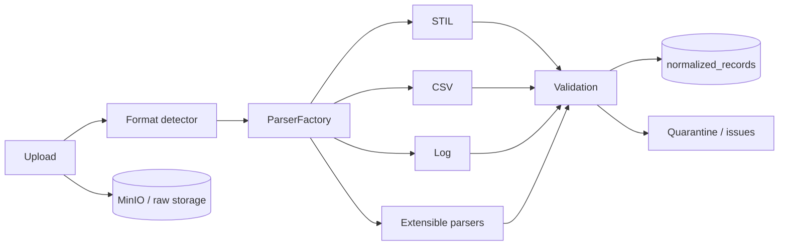

# 06 — Parser Framework

**Related:** [01 System Architecture](01_SYSTEM_ARCHITECTURE.md) · [02 Software Design](02_SOFTWARE_DESIGN_SPECIFICATION.md) · [03 Database](03_DATABASE_DESIGN.md) · [07 Security](07_SECURITY_ARCHITECTURE.md)

---

## 1. Purpose

Ingest heterogeneous semiconductor artifacts (STIL, CSV die results, tester logs, JSON/XML where enabled) into a normalized schema with validation, quarantine, and auditability.

## 2. Dual Ingestion Paths

| Path | Location | Role |
|------|----------|------|
| Production ingestion | `backend/ingestion/` | HTTP uploads, datasets, STIL/CSV/LOG parsers, PostgreSQL persistence |
| Adapter SDK | `adapters/` | Customer ASCII formats via YAML or Python plugins (CLI / batch) |

Both paths should converge on stable normalized fields (lot, wafer, die, pass/fail, stage, timestamps, source identity).

## 3. Production Parser Factory



Key modules: `parser_factory.py`, `stil_parser.py`, `validation.py`, `upload_service.py`, `dataset_service.py`.

## 4. Adapter SDK (plugins)

### Canonical record fields (minimum)
`lot_id`, `wafer_id`, `die_id`, `test_stage`, `tester_id`, `pass_fail`, `timestamp`, `source_file`, `adapter_id`

### Built-in adapters

| ID | Format |
|----|--------|
| `stdf_v4` | STDF binary |
| `verilumen_scan_v1` | Verilumen ATE logs |
| `generic_datalog` | YAML-mapped ASCII |
| `csv_die_results` | YAML-mapped CSV |

### Extension options

1. **YAML:** copy `config/adapters/generic_datalog.yaml`, set `detect.regex_lines` and field regexes.
2. **Python:** subclass `LogAdapter`, register in `adapters/registry.py`.

CLI example:

```powershell
python main.py --log-dir tests/fixtures --use-adapter-ingestion --recursive
```

## 5. Validation Pipeline

1. MIME / extension allow-list  
2. Size limit (`MAX_UPLOAD_BYTES`, default up to multi-GB)  
3. Filename sanitization (path traversal blocked)  
4. Checksum / dedupe policy (`allow_duplicate` where configured)  
5. Schema & integrity checks → `validation_results`  
6. Quarantine malformed records without discarding the entire lot when possible  

## 6. Plugin Manager Principles

| Concern | Practice |
|---------|----------|
| Interface | Stable parser/adapter contract |
| Discovery | Factory / registry by format id |
| Versioning | Semantic version on adapter metadata |
| Safety | No untrusted code execution in production without review |
| Tests | Golden fixtures per format |

## 7. Persistence Touchpoints

- Raw bytes → object store / `backend/storage/raw/`
- Metadata → `uploads`, `parser_metadata`, `ingestion_datasets`
- Facts → `normalized_records`
- Stats → `ingestion_statistics`
- Audits → `audit_logs` / upload history

See [03 Database Design](03_DATABASE_DESIGN.md).

## 8. Cross-References

- Upload API → [04](04_API_SPECIFICATION.md)
- Upload security → [07](07_SECURITY_ARCHITECTURE.md)
- Operator workflow → [10](10_USER_GUIDE.md)
