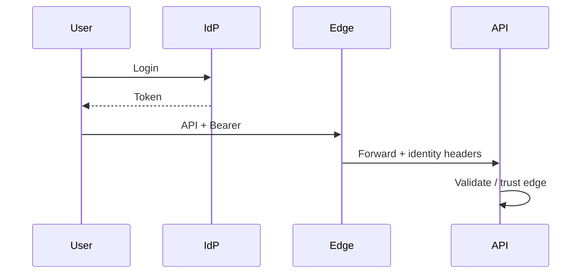

# 07 — Security Architecture

**Related:** [01 System Architecture](01_SYSTEM_ARCHITECTURE.md) · [04 API](04_API_SPECIFICATION.md) · [09 Deployment](09_DEPLOYMENT_GUIDE.md)

---

## 1. Purpose

Protect semiconductor IP (patterns, yields, process data), ensure accountability, and harden upload/API surfaces.

## 2. Threat Model (summary)

| Threat | Mitigation |
|--------|------------|
| Unauthorized analysis / export | RBAC on production routes |
| Injection | Parameterized SQLAlchemy; Pydantic validation |
| Path traversal / malicious upload | Filename sanitize, MIME allow-list, size caps |
| Abuse / DoS | Per-client rate limiting |
| Secret leakage | Env-based secrets; no secrets in git |
| Audit gaps | Append-only audit logs per module |

## 3. Authentication

**Current (dev / trusted gateway):** identity via headers `X-User-Id`, `X-Role` assumed set by a reverse proxy or service mesh.

**Target production:** OIDC (Azure AD / Okta) → JWT validated by API (issuer, audience, expiry). Short-lived tokens; service accounts for batch jobs.

**Assumption:** header trust requires a hardened perimeter. Do not expose the API raw on the public internet without an authenticating edge.

## 4. Authorization (RBAC)

| Role | Typical access |
|------|----------------|
| `admin` | Full generate / export / admin |
| `failure_engineer` | Analyze, predict, feedback |
| `yield_engineer` | Rates, wafer, reports |
| `quality_engineer` | Reports, benchmarks, read analytics |
| `service` | Automation / pipeline |
| `report_viewer` | Read-only reports (where enabled) |

Denied → `403` with codes such as `*_ACCESS_DENIED`. Enforce at API boundary and again on export/download.

## 5. Secrets Management

- Use `.env` locally (from `.env.example`); never commit real credentials.
- Production: secret manager / sealed secrets / platform vault.
- Rotate DB and object-store credentials regularly.
- Separate credentials for API, workers, and migrations where practical.

## 6. Upload Security

- Allow-listed extensions / MIME types  
- Max upload size (`MAX_UPLOAD_BYTES`)  
- Sanitize filenames; reject `..` and absolute paths  
- Store raw objects outside web root (MinIO / controlled storage path)  
- Checksum and optional duplicate rejection  
- Quarantine invalid records; log validation issues  

Details: [06 Parser Framework](06_PARSER_FRAMEWORK.md).

## 7. OWASP-Oriented Controls

| OWASP area | Control |
|------------|---------|
| Injection | ORM parameterization; no string-built SQL |
| Broken auth | Move to OIDC; avoid long-lived shared keys |
| Broken access control | RBAC checks on mutations and exports |
| Security misconfiguration | Disable open CORS in production; TLS at edge |
| Vulnerable components | Pin dependencies; scan images/SBOMs |
| Logging & monitoring | Structured audits; alert on auth failures |
| SSRF / unsafe fetches | No user-controlled internal URL fetch without allow-list |

**Note:** `CORS allow_origins=["*"]` in development is not acceptable for production — restrict origins in deploy config.

## 8. Data Protection

- TLS termination at load balancer / ingress  
- Least-privilege DB roles (app vs migrate)  
- Mask sensitive operator/equipment fields in exports where required  
- Append-only analytics history for forensic review  
- Future: row-level tenant isolation, field-level encryption for sensitive columns  

## 9. Cross-References

- API error codes → [04](04_API_SPECIFICATION.md)
- Network topology → [09](09_DEPLOYMENT_GUIDE.md)
- Logging → [01](01_SYSTEM_ARCHITECTURE.md)
