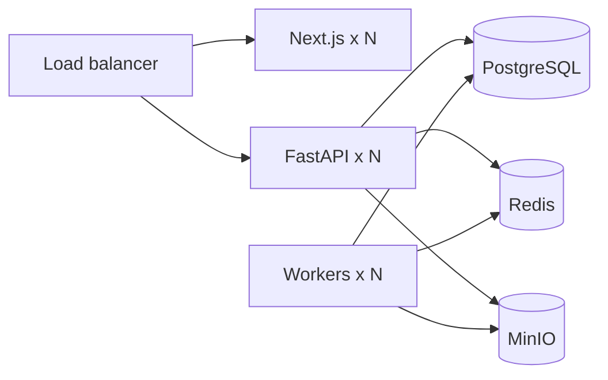

# 09 — Deployment Guide

**Related:** [01 System Architecture](01_SYSTEM_ARCHITECTURE.md) · [03 Database](03_DATABASE_DESIGN.md) · [07 Security](07_SECURITY_ARCHITECTURE.md) · [10 User Guide](10_USER_GUIDE.md)

---

## 1. Purpose

Run the Failure Analysis Agent locally and in production-like environments, including migrations, optional workers, backup, and DR guidance.

## 2. Prerequisites

- Python 3.12+ (3.10+ for CLI agent paths)
- Node.js 20+ (for `ate-dashboard`)
- PostgreSQL 14+ (17 recommended)
- Optional: Redis, MinIO, Docker

Copy environment template:

```powershell
Copy-Item .env.example .env
# Set DATABASE_PASSWORD and other secrets
```

## 3. Local Development

### Database

```powershell
# Create DB failure_analysis_db (once)
$env:PYTHONPATH = (Get-Location).Path
python -m alembic upgrade head
```

### API

```powershell
pip install -r backend/requirements.txt
$env:PYTHONPATH = (Get-Location).Path
python -m uvicorn backend.main:app --reload --port 8000
```

Health: `http://localhost:8000/health` · OpenAPI: `http://localhost:8000/docs`

### Production dashboard

```powershell
cd ate-dashboard
npm install
npm run dev
```

Open `http://localhost:3000` (proxies `/api/*` to FastAPI).

### Evaluation workbench (optional)

```powershell
cd frontend
npm install
npm run dev
```

Open `http://localhost:5173`.

### Optional Celery worker (ingestion)

```powershell
$env:CELERY_ENABLED = "true"
$env:REDIS_URL = "redis://localhost:6379/0"
celery -A backend.celery_app:celery_app worker -Q ingestion -l info
```

### CLI agent (batch)

```powershell
python main.py --log-dir tests/fixtures --use-adapter-ingestion --recursive
python dashboard.py   # optional local UI on :8000
```

## 4. Docker Architecture (target)

Suggested services (compose/k8s manifests may be added per environment):

| Service | Role |
|---------|------|
| `api` | uvicorn FastAPI |
| `worker` | Same image, queue consumer |
| `dashboard` | Next.js |
| `postgres` | System of record |
| `redis` | Cache / rate limit / queue |
| `minio` | Raw uploads & report exports |
| `migrate` | One-shot `alembic upgrade head` |



Practices: non-root containers, healthchecks, migrate before API ready, multi-stage slim images, SBOM + vulnerability scan.

## 5. Kubernetes (target)

- Deployments for API, workers, dashboard  
- Services + Ingress with TLS  
- HorizontalPodAutoscaler on CPU / custom queue depth  
- Secrets via Sealed Secrets / external secrets operator  
- PersistentVolumeClaims only if not using managed Postgres/S3  

Prefer managed PostgreSQL and object storage in cloud.

## 6. CI/CD (recommended)

1. Lint / typecheck (Python + TypeScript)  
2. Unit + API tests (`unittest` / pytest as configured)  
3. `alembic upgrade head` against ephemeral Postgres  
4. Build & scan container images  
5. Deploy migrate job → API/workers → dashboard  
6. Smoke: `/health` + upload + one analyze path  

Do not skip migrations on release.

## 7. Backup Strategy

| Asset | Method | Retention (illustrative) |
|-------|--------|--------------------------|
| PostgreSQL | Continuous WAL + daily base backup | 30–90 days |
| MinIO / object store | Versioning + cross-site sync | Align to legal hold |
| Config YAML | Git | Permanent |
| Secrets | Vault snapshots | Policy-driven |

Encrypt backups; test restores quarterly.

## 8. Disaster Recovery

| Item | Illustrative target |
|------|---------------------|
| RPO | ≤ 15 minutes |
| RTO | ≤ 4 hours |

Runbooks: restore Postgres, rebind secrets, rehydrate Redis (cache only), verify MinIO objects, smoke-test API and one full FA-FR path.

## 9. High Availability Checklist

- API/UI replicas ≥ 2  
- Postgres primary + replica with failover  
- Redis Sentinel/Cluster for multi-node rate limits  
- MinIO erasure coding or cloud S3  
- Workers ≥ 2 with job requeue on crash  

## 10. Cross-References

- Security hardening → [07](07_SECURITY_ARCHITECTURE.md)
- Schema apply → [03](03_DATABASE_DESIGN.md)
- Operator UI → [10](10_USER_GUIDE.md)
