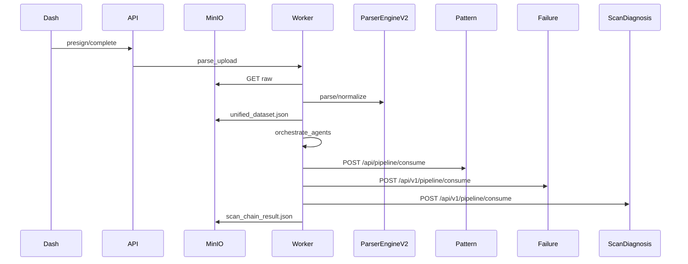
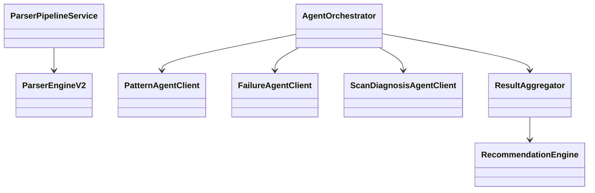

# Scan Chain Enterprise Pipeline

## Architecture

One upload continuum in Backend (`Backend-and-DP-s-main`):

1. Dashboard presign → MinIO PUT → complete  
2. ARQ `parse_upload` → **ParserEngineV2 only** → unified dataset in MinIO + `normalized_records`  
3. ARQ `orchestrate_agents` → Pattern + Failure (parallel HTTP) → Scan Diagnosis  
4. Aggregator + Recommendation Engine → Postgres + MinIO artifacts → dashboard refresh  

Agents never upload and never parse raw originals. Orchestrator is the only executor.



## Class diagram



## Key modules

| Path | Role |
|------|------|
| `app/services/parser_pipeline.py` | Sole raw-file reader via Parser Engine v2 |
| `app/orchestration/orchestrator.py` | Parallel agent fan-out + merge |
| `app/orchestration/agent_clients.py` | httpx clients |
| `app/routers/jobs.py` | jobs/progress/results/retry/orchestrator |
| `app/domain/unified_dataset.py` | Enterprise schema |
| Agent `pipeline/consume_api.py` | Dataset consume (no file parsers) |

## Agent run APIs (Option 1)

| Agent | Endpoint | Body |
|-------|----------|------|
| Pattern | `POST /api/v1/pattern/run` | `{ job_id, dataset_path, metadata }` |
| Failure | `POST /api/v1/failure/run` | `{ job_id, dataset_path, metadata }` |
| Scan | `POST /api/v1/scan/run` | `{ job_id, dataset_path, pattern_result_path, failure_result_path, metadata }` |

Legacy `*/pipeline/consume` routes remain as aliases.

## Local output tree

```
C:\personal\agent and parser output\<job_id>\
  parser\unified_dataset.json
  pattern\report.json
  failure\report.json
  scan\report.json
  recommendation\recommendations.json
  dashboard\kpis.json
  reports\scan_chain_result.json
  logs\pipeline.log
```

Orchestrator prefers local `dataset_path` when present; MinIO remains the durable store.

## Tables (migration `004_scan_chain_pipeline`)

`parser_jobs`, `parser_statistics`, `parsed_files`, `normalized_records`, `pattern_results`, `failure_results`, `diagnosis_results`, `recommendation_results`, `dashboard_metrics`, `agent_execution_logs`

## Progress stages

Uploading → Validating → Detecting Format → Parsing → Generating Metadata → Normalizing → Running Pattern Analysis → Running Failure Analysis → Running Scan Diagnosis → Aggregating Results → Saving Results → Refreshing Dashboard → Completed
